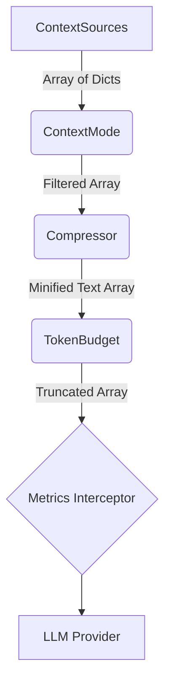

# Component Architecture

ContextFlow relies on a sequential mapping pipeline. Each step implements a defined interface, accepting an array of `messages` and yielding a mutated version of that array.

## Abstract Layers (`interfaces.py`)

### 1. `ContextSource`
Sources map external raw data (logs, memory persistence layers, or user text) into the standard message dictionary format (`{"role": "...", "content": "..."}`).

### 2. `ContextMode`
A heuristic filter. Rather than looking closely at text content, modes make quick categorical decisions. Examples: "Only keep messages tagged 'goal'", "Only keep the last 3 logs".

### 3. `Compressor`
The heart of deterministic optimization. The compressor loops through message objects and runs text-cleaning logic on the `"content"` strings. It removes redundant whitespace, LLM pleasantries, and deterministic file noise *before* tokenization.

### 4. `TokenBudget`
An explicit boundary enforcer. Interacts closely with the backend Provider's expected tokenizer to ensure the final payload mathematically fits the context window without causing API crashes.

### 5. `Provider`
The adapter layer matching the array to the vendor API (e.g., Litellm, OpenAI, Anthropic, Ollama). It handles async networking and returns the final LLM response.

## SOLID Principles in Action
By leveraging these abstractions, users can replace a `Compressor` without impacting their `TokenBudget`, or transition from `OpenAI` to a local `Ollama` loop simply by registering a different Provider adapter. The pipeline orchestration (`pipeline.py`) remains static.
